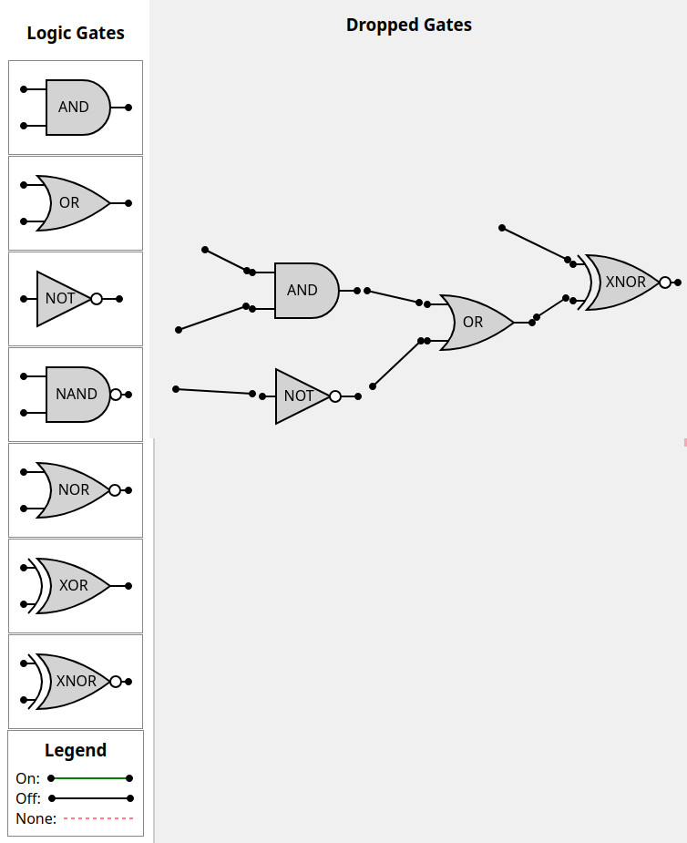

# Logic Gate Circuit Builder

This is a simple project to create a logic gate circuit builder
in the browser. This project uses Rust with [leptos](https://github.com/leptos-rs/leptos)!

<div style="text-align: center;">
    
</div>


## Features
- Drawing of logic gates.
- Drag and drop logic gates.
- Moving logic gates on screen.
- Creating wires on screen.

## TODOs
- Edit wires start and end points.
- Connecting wires to logic gates.
- Some switch to simulate powered on or "true"
- Showing whether wires are "On" or "Off"
- Simulate logic gate expressions.
- Drawing logic gates 2 or more inputs.
- Save logic gate circuit to a file.
- Load logic gate circuit to a file.
- Logic gate puzzles

## Building

If you don't have `cargo-leptos` installed you can install it with

`cargo install cargo-leptos --locked`

## Running

`cargo leptos watch`  
By default, you can access your local project at `http://localhost:3000`

## Installing Additional Tools

By default, `cargo-leptos` uses `nightly` Rust, `cargo-generate`, and `sass`. If you run into any trouble, you may need to install one or more of these tools.

1. `rustup toolchain install nightly --allow-downgrade` - make sure you have Rust nightly
2. `rustup target add wasm32-unknown-unknown` - add the ability to compile Rust to WebAssembly
3. `cargo install cargo-generate` - install `cargo-generate` binary (should be installed automatically in future)
4. `npm install -g sass` - install `dart-sass` (should be optional in future)

## Executing a Server on a Remote Machine Without the Toolchain
After running a `cargo leptos build --release` the minimum files needed are:

1. The server binary located in `target/server/release`
2. The `site` directory and all files within located in `target/site`

Copy these files to your remote server. The directory structure should be:
```text
leptos_start
site/
```
Set the following environment variables (updating for your project as needed):
```sh
export LEPTOS_OUTPUT_NAME="leptos_start"
export LEPTOS_SITE_ROOT="site"
export LEPTOS_SITE_PKG_DIR="pkg"
export LEPTOS_SITE_ADDR="127.0.0.1:3000"
export LEPTOS_RELOAD_PORT="3001"
```
Finally, run the server binary.